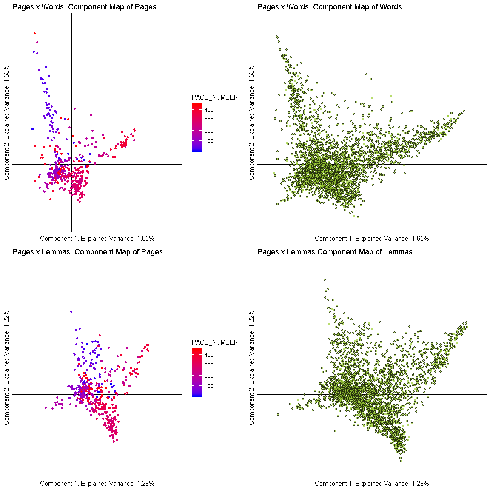
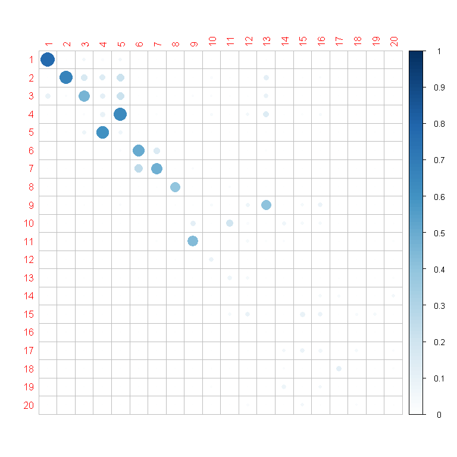

Correspondence analyses of the Mueller Report
================

# The gist

# Background

\[Come back to this. So I think this should break into three analyses.
This one is the first/primary: CAs of the frequencies per page. then the
0/1 and relate it to graphs, then MCD (which connects back to bivariate
& row/column flip)\]

Explain the two data sets and the motivation

# Explanation of the directory structure

# Cleaning and preprocessing

For processing of the text, I did little additional work on top of two
analyses already performed:
[batpigandme/tidymueller](https://github.com/batpigandme/tidymueller)
and [cbail/mueller\_report](https://github.com/cbail/mueller_report). A
few extra cleaning steps were performed that align with [some of our
previous work on
NeuroSynth](https://www.biorxiv.org/content/10.1101/157826v3), and that
code can be found in
[fahd09/neurosynth\_semantic\_map](https://github.com/fahd09/neurosynth_semantic_map).

# Basics of the analyses

In principle, these analyses are virtually the same as what we did for
the NeuroSynth database (see [our paper on correspondence analysis of
manuscript-by-terms in the NeuroSynth
database](https://www.biorxiv.org/content/10.1101/157826v3) and
[fahd09/neurosynth\_semantic\_map](https://github.com/fahd09/neurosynth_semantic_map)).

# Correspondence analyses of the Mueller Report

Scree plot stolen from [Matt
Kmiecik](https://mattkmiecik.com/post-Exploring-11-Years-of-Chicago-Blackhawks-Data-using-Principal-Components-Analysis.html).

<!-- -->

<!-- -->

Set up motivation
<!-- -->

Explanation

# Conclusions & More

What we can conclude from this The multiple directions we can go from
this: (1) Methodologically (2) Interpretting a lot to unpack from these
results if one so chooses.
